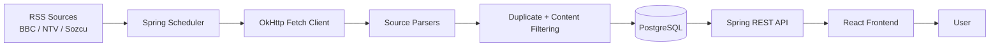

# NewsFlow


NewsFlow is a full-stack news aggregation application. It collects RSS feeds from multiple Turkish news sources, normalizes them into a single data model, stores them in PostgreSQL, and serves a modern paginated React interface.

The project started as an early junior full-stack project and has been refactored into a cleaner local development setup with Docker Compose, server-side pagination, source filtering, duplicate protection, and a refreshed editorial UI.

## Preview

### News Feed


### Article Detail


## Features

- Scheduled RSS ingestion from BBC Turkish, NTV, and Sozcu.
- Source-specific parsers for different RSS and Atom feed shapes.
- PostgreSQL persistence with unique news links.
- Server-side pagination and publisher filtering.
- Caffeine cache for duplicate URL checks and response caching.
- Resilience4j rate limiting for public API endpoints.
- React + Vite frontend with a responsive editorial layout.
- Docker Compose setup for PostgreSQL, backend, frontend, and pgAdmin.
- Swagger UI for API exploration.

## Tech Stack

| Layer | Technology |
| --- | --- |
| Backend | Java 17, Spring Boot 3.1.5, Spring Web, Spring Data JPA |
| Database | PostgreSQL 16 |
| Parsing | OkHttp, org.json XML conversion, Jsoup |
| API utilities | ModelMapper, Caffeine Cache, Resilience4j, Springdoc OpenAPI |
| Frontend | React 18, Vite 5, React Router, Axios, Tailwind CSS |
| Runtime | Docker Compose, Nginx |

## Architecture



## Project Structure

```text
newsflow/
|-- backend/
|   `-- JavaNewsRss/
|       |-- src/main/java/com/example/javanewsrss/
|       |   |-- controller/          # REST endpoints
|       |   |-- service/             # business flow, scheduler, cache
|       |   |-- service/parse/       # BBC, NTV, Sozcu RSS parsers
|       |   |-- service/fetch/       # HTTP clients
|       |   |-- repository/          # Spring Data JPA repository
|       |   |-- model/               # entities and DTOs
|       |   `-- exception/           # global exception handling
|       |-- src/main/resources/
|       |   `-- application.yml
|       |-- docker-compose.yml
|       `-- Dockerfile
|-- frontend/
|   |-- src/
|   |   |-- pages/                   # feed and detail pages
|   |   |-- layout/                  # top navigation
|   |   `-- services/                # API client
|   |-- Dockerfile
|   `-- nginx.conf
`-- screens/
    |-- newsflow-home.png
    `-- newsflow-detail.png
```

## Requirements

For the Docker workflow:

- Docker Desktop
- Java 17

For frontend-only local development:

- Node.js 20+
- pnpm 9.15.9 or Corepack

## Quick Start With Docker

The recommended local workflow runs PostgreSQL, backend, frontend, and pgAdmin through Docker Compose.

### 1. Clone the repository

```bash
git clone git@github.com:denizsullu/newsflow.git
cd newsflow
```

### 2. Build the backend jar

The backend Docker image copies the Spring Boot jar from `target/`, so build it once before starting Compose.

Windows:

```powershell
cd backend\JavaNewsRss
.\mvnw.cmd -DskipTests package
```

macOS / Linux:

```bash
cd backend/JavaNewsRss
chmod +x mvnw
./mvnw -DskipTests package
```

### 3. Start the stack

Run this from `backend/JavaNewsRss`:

```bash
docker compose up --build -d
```

### 4. Open the application

| Service | URL |
| --- | --- |
| Frontend | http://localhost:3000 |
| Backend API | http://localhost:8080 |
| Swagger UI | http://localhost:8080/swagger-ui/index.html |
| pgAdmin | http://localhost:5050 |
| PostgreSQL | `localhost:5432` |

The backend fetches RSS sources on startup and then refreshes them on the scheduled interval.

## pgAdmin Login

Open http://localhost:5050 and log in with:

```text
Email: admin@admin.com
Password: admin
```

Add a new server manually:

```text
Name: NewsFlow Local
Host: postgres
Port: 5432
Database: deneme
Username: mycustomuser
Password: mysecretpassword
```

Use `postgres` as the host inside pgAdmin because pgAdmin runs inside the Docker Compose network. If you connect from a desktop client such as DataGrip or DBeaver, use `localhost`.

## API Endpoints

Base URL:

```text
http://localhost:8080/api/news
```

| Method | Endpoint | Description |
| --- | --- | --- |
| GET | `/getAllNewsResponses` | Returns all news ordered by publish date. |
| GET | `/getNewsPageable?page=0&size=12` | Returns paginated news. |
| GET | `/getNewsPageable?page=0&size=12&publisher=Sozcu` | Returns paginated news filtered by publisher. |
| GET | `/publisher/{publisher}` | Returns all news for a publisher. |
| GET | `/findByUUID?uuid={id}` | Returns a single article detail. |

Example:

```bash
curl "http://localhost:8080/api/news/getNewsPageable?page=0&size=12&publisher=BBC"
```

## Local Development

### Backend

Start only PostgreSQL:

```bash
cd backend/JavaNewsRss
docker compose up -d postgres
```

Run the backend against local PostgreSQL:

Windows PowerShell:

```powershell
$env:SPRING_DATASOURCE_URL="jdbc:postgresql://localhost:5432/deneme"
$env:SPRING_DATASOURCE_USERNAME="mycustomuser"
$env:SPRING_DATASOURCE_PASSWORD="mysecretpassword"
.\mvnw.cmd spring-boot:run
```

macOS / Linux:

```bash
SPRING_DATASOURCE_URL=jdbc:postgresql://localhost:5432/deneme \
SPRING_DATASOURCE_USERNAME=mycustomuser \
SPRING_DATASOURCE_PASSWORD=mysecretpassword \
./mvnw spring-boot:run
```

### Frontend

The Vite dev server proxies `/api` requests to `http://localhost:8080`.

```bash
cd frontend
corepack enable
corepack prepare pnpm@9.15.9 --activate
pnpm install
pnpm dev
```

Open:

```text
http://localhost:5173
```

## Environment Configuration

The default Docker Compose values are:

```text
POSTGRES_DB=deneme
POSTGRES_USER=mycustomuser
POSTGRES_PASSWORD=mysecretpassword
SPRING_DATASOURCE_URL=jdbc:postgresql://postgres:5432/deneme
```

RSS source URLs are configured in:

```text
backend/JavaNewsRss/src/main/resources/application.yml
```

Current sources:

```text
BBC:   https://www.bbc.co.uk/turkce/index.xml
NTV:   https://www.ntv.com.tr/son-dakika.rss
Sozcu: https://www.sozcu.com.tr/feeds-haberler
```

## Useful Commands

Run the full stack:

```bash
cd backend/JavaNewsRss
docker compose up --build -d
```

Show running services:

```bash
docker compose ps
```

Follow backend logs:

```bash
docker compose logs -f backend
```

Stop containers:

```bash
docker compose down
```

Stop containers and remove PostgreSQL data:

```bash
docker compose down -v
```

Rebuild after backend code changes:

```bash
cd backend/JavaNewsRss
./mvnw -DskipTests package
docker compose up --build -d backend
```

Rebuild after frontend code changes:

```bash
cd backend/JavaNewsRss
docker compose up --build -d frontend
```

## Troubleshooting

### pgAdmin does not show PostgreSQL automatically

This is expected. pgAdmin does not auto-discover Compose services. Add the server manually and use `postgres` as the host.

### The API returns an empty list at first

Check backend logs:

```bash
docker compose logs -f backend
```

The backend needs outbound access to RSS sources. The Compose file includes public DNS resolvers for the backend service.

### Tests fail with `UnknownHostException: postgres`

The default application config uses the Docker hostname `postgres`. When running tests directly on the host machine, use a test profile or override the datasource URL to `localhost`.

### Frontend cannot reach the API

In Docker, Nginx proxies `/api` to `backend:8080`. In Vite development, `vite.config.js` proxies `/api` to `http://localhost:8080`. Make sure the backend is running.

## License

This project is licensed under the MIT License. See [LICENSE.md](LICENSE.md) for details.
